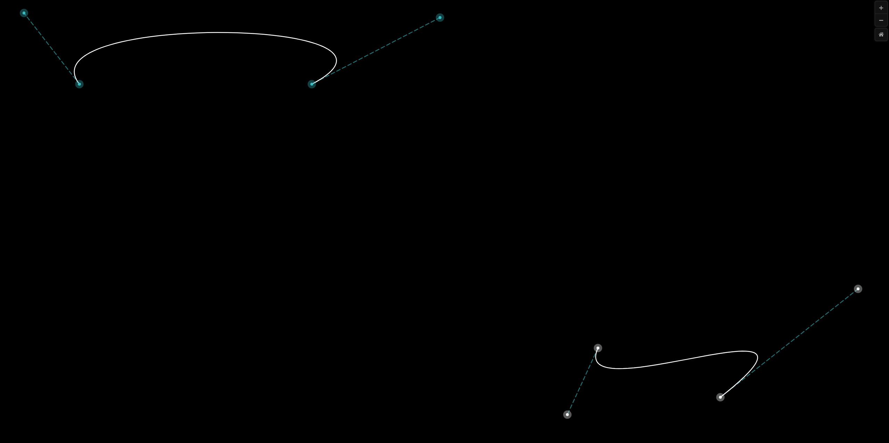
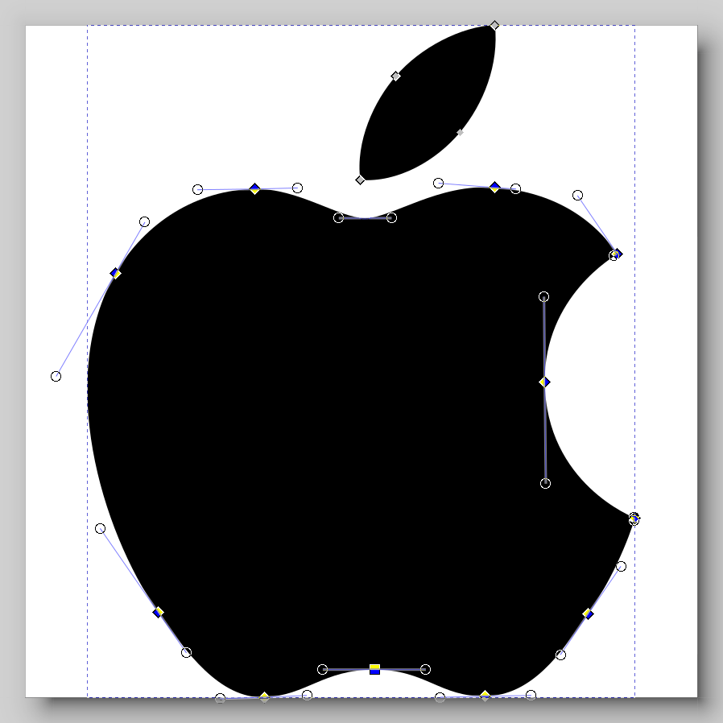

<link rel="preconnect" href="https://fonts.googleapis.com">
<link rel="preconnect" href="https://fonts.gstatic.com" crossorigin>
<link href="https://fonts.googleapis.com/css2?family=Black+Han+Sans&display=swap" rel="stylesheet">

# <!--fit-->3차 곡선에 대한 탐구

## 벡터 이미지는 어떻게 만들어지는가

<small>by **10315** 이도이</small>

---

## Vector 이미지

- Scalable Vector Graphics
- 확대해도 깨지지 않는 이미지

---

<!--_transition: fade-->

---

---

## 발명

- Bernstein Polynomial
- De Casteljau Algorithm
- Pierre Bézier

---

## Lerp

<small>$P_0$ 와 $P_1$ 사이의 점 $P$가 존재, $P_0$, $P_1$ 사이 거리 비율로 $P$ 표현
Linear Interpolation - 선형 보간 함수 - lerp
</small>

 

> $$
> lerp(P_0, P_1, t) = (1-t) \cdot P_0 + t \cdot P_1,\,0 \leq t \leq 1
> $$

---

## De Casteljau's Algorithm

* 점 $2$개 Lerp → Linear Bézier Curve
* 점 $3$개 Lerp → Quadratic Bézier Curve
* 점 $4$개 Lerp → Cubic Bézier Curve
* 점 $N$개 Lerp → $N-1$-th Bézier Curve

---

### Linear Bézier

  
  
<iframe src="https://www.desmos.com/calculator/ehfqlvs10h?embed" width="500" height="500" style="border: 1px solid #ccc" frameborder=0></iframe>

$$
P = lerp(P_0, P_1, t)
$$

---

### Quadratic Bézier

<iframe src="https://www.desmos.com/calculator/yvanai4rim?embed" width="500" height="500" style="border: 1px solid #ccc" frameborder=0></iframe>

$$
\begin{gather}
Q_0 = lerp(P_0, P_1, t) \\
Q_1 = lerp(P_1, P_2, t) \\
\\
P = lerp(Q_1, Q_2, t)
\end{gather}
$$

---

### Cubic Bézier

<iframe src="https://www.desmos.com/calculator/ghpvgn98s9?embed" width="500" height="500" style="border: 1px solid #ccc" frameborder=0></iframe>

$$
\begin{gather}
Q_0 = lerp(P_0, P_1, t) \\
Q_1 = lerp(P_1, P_2, t) \\
Q_2 = lerp(P_2, P_3, t) \\
\\
R_0 = lerp(Q_0, Q_1, t) \\
R_1 = lerp(Q_1, Q_2, t) \\
\\
P = lerp(R_0, R_1, t)
\end{gather}
$$

---

### Cubic Bézier

<iframe src="https://www.desmos.com/calculator/3gr7bkbnjy?embed" width="500" height="500" style="border: 1px solid #ccc" frameborder=0></iframe>

$$
\begin{gather*}

Q_0 = (1-t)\cdot {\color{red}P_0} \, + \, t\cdot {\color{green}P_1}\\
Q_1 = (1-t)\cdot {\color{green}P_1} \, + \, t\cdot {\color{blue}P_2} \\
Q_2 = (1-t)\cdot {\color{blue}P_2} \, + \, t\cdot {\color{yellow}P_3} \\
\\
R_0 = (1-t)\cdot Q_0 \, + \, t\cdot Q_1\\
R_1 = (1-t)\cdot Q_1 \, + \, t\cdot Q_2 \\
\\
P = (1-t)\cdot Q_1 \, + \, t\cdot Q_2 \\

\end{gather*}
$$

---

De Casteljau's Algorithm, $N = 4$ 일때 $P$에 대해 정리

 

$$

\begin{equation}
\begin{aligned}
R_0 &= (1-t)\cdot Q_0 \, + \, t\cdot Q_1 \\
	&= (1-t)\cdot [\,(1-t)\cdot {\color{red}P_0} \, + \, t\cdot {\color{green}P_1}\,] \, + \, t\cdot [\,(1-t)\cdot {\color{green}P_1} \, + \, t\cdot {\color{blue}P_2}\,] \\
	&= (1-t)^2 \cdot {\color{red}P_0} + 2 \cdot (1-t) \cdot t \cdot {\color{green}P_1} + t^2 \cdot {\color{blue}P_2}

\\\\

R_1 &= (1-t)\cdot Q_1 \, + \, t\cdot Q_2 \\
	&= (1-t)\cdot [\,(1-t)\cdot {\color{green}P_1} \, + \, t\cdot {\color{blue}P_2}\,] \, + \, t\cdot [\,(1-t)\cdot {\color{blue}P_2} \, + \, t\cdot {\color{yellow}P_3}\,] \\
	&= (1-t)^2 \cdot {\color{green}P_1} + 2 \cdot (1-t) \cdot t \cdot {\color{blue}P_2} + t^2 \cdot {\color{yellow}P_3}

\\\\

P &= (1-t)\cdot Q_1 \, + \, t\cdot Q_2 \\
	&= (1-t) \cdot [\,(1-t)^2 \cdot {\color{red}P_0} + (1-t) \cdot t \cdot {\color{green}P_1} + t^2 \cdot {\color{blue}P_2}\,] + t \cdot [(1-t)^2 \cdot {\color{green}P_1} + (1-t) \cdot t \cdot {\color{blue}P_2} + t^2 \cdot {\color{yellow}P_3}] \\
	&= (1-t)^3 \cdot {\color{red}P_0} + 3 \cdot (1-t)^2 \cdot t \cdot {\color{green}P_1} + 3 \cdot (1-t) \cdot t^2 \cdot {\color{blue}P_2} + t^3 \cdot {\color{yellow}P_3}
\end{aligned}
\end{equation}

$$

---

De Casteljau's Algorithm, $N = 4$ 일때 $P$에 대해 정리

 

$$
(1-t)^3 \cdot {\color{red}P_0} + 3 \cdot (1-t)^2 \cdot t \cdot {\color{green}P_1} + 3 \cdot (1-t) \cdot t^2 \cdot {\color{blue}P_2} + t^3 \cdot {\color{yellow}P_3}
$$

---

## Bernstein's Polynomial

조절점 $P_0, P_1, P_2, ..., P_n$ 에 대한 Bézier Curve

 

> $$
> P(t) = \sum_{i=0}^n P_i {n  \choose i}(1-t)^{n-i}t^i P_i,\,0 \leq t \leq 1
> $$

---

$n=3$ 일때

 

$$
\begin{equation}
\begin{aligned}
P(t) &= \sum_{i=0}^n {n  \choose i}(1-t)^{n-i}t^i P_i \\
     &= (1-t)^3 \cdot {\color{red}P_0} + 3 \cdot (1-t)^2 \cdot t \cdot {\color{green}P_1} + 3 \cdot (1-t) \cdot t^2 \cdot {\color{blue}P_2} + t^3 \cdot {\color{yellow}P_3}
\end{aligned}
\end{equation}

$$

---

<iframe src="https://www.desmos.com/calculator/czhu7lwtoe?embed" width="500" height="500" style="border: 1px solid #ccc" frameborder=0></iframe>

  

  
  $y={\color{red}(1-t)^3}$
  $y={\color{green}3 \cdot (1-t)^2 \cdot t}$
  $y={\color{blue}3 \cdot (1-t) \cdot t^2}$
  $y={\color{yellow}t^3}$
  
  

---

## 활용

- **S**calable **V**ector **G**raphics
- 애니메이션 트렌지션

---

### **S**calable **V**ector **G**raphics

---

---

---

## 애니메이션 트렌지션

<iframe src="transition.html" width="400" height="460" frameborder=0></iframe>

- linear
- ease
- ease-in
- ease-out
- ease-in-out

---

## 요약

- 선분의 내분점을 표현하는 함수 $Lerp$
- Bézier Curve를 구현 하는 방법
  - Bernstein Polynomial
  - De Casteljau Algorithm 
- SVG와 트렌지션 등 다양한 곳에서 사용

---

## 느낀점

  <small>
    
일상 생활속에서 당연한듯 사용되고있는 수학적 원리를 평소에는 신경쓰거나 인지하지 못했는데, 한번 관심을 가지고나니, 내 주위를 둘러싼 세계에서 다양한 수학적 원리를 찾고, 탐구하고 싶어졌다.

  
앞으로도 재미있거나 흥미로운 수학적 원리를 탐구하고 싶다.

  </small>

---

## 출처

<small>

  - <https://pomax.github.io/bezierinfo/>
  - <https://cubic-bezier.com/>
  - <https://developer.mozilla.org/en-US/docs/Web/SVG/Tutorial/Paths>
  - <https://en.wikipedia.org/wiki/B%C3%A9zier_curve>
  - <https://www.desmos.com/calculator>
  - Defining a curve as a Bezier curve (<https://doi.org/10.1080/16583655.2019.1601913>)
</small>
