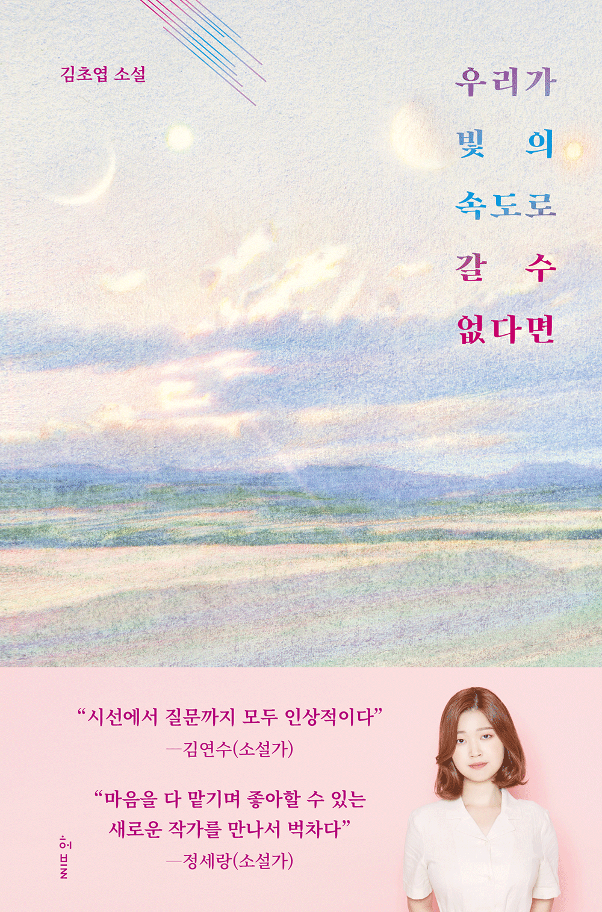
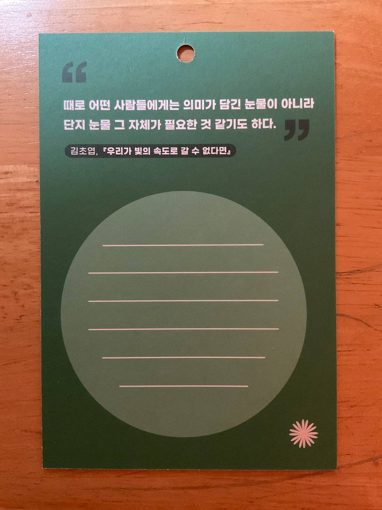

<!--paginate: false-->

# 사람과 사람의 감정

김초엽, 『우리가 빛의 속도로 갈 수 없다면』, 「감정의 물성」 을 읽고.

<small class="muted">10315 이도이</small>

---

<!--paginate: true-->
<!--header: 사람과 사람의 감정 「감정의 물성」-->

<!--
서점에 갔는데, 이러한 카드가 있었다.
문구가 마음에 와닿았다.
-->

## 책 선정 이유

 

*때로 어떤 사람들에게는 의미가 담긴 
눈물이 아니라 단지 눈물 그 자체가
필요한 것 같기도 하다.* 

 

꼭 의미가 필요한걸까?

---

## 줄거리

- 잡지 기자인 '정하'는 어느날 행복, 집착, 공포, 우울과 같은 감정을 조형화한 제품인 
    '**감정의 물성**' 이 인기를 끄는 현상에 관심을 갖게된다.
- '감정의 물성'을 사용하면 실제로 그 감정을 느끼게 된다는 점에서 인기를 끌었는데,
    정하는 이 효과가 그저 유사과학이나 상술에 불과한 것이라고 생각한다.
- 연인 '보현'이 우울한 감정을 조형화한 우울체 제품들에 빠져 있자, 사람들이 긍정적인
감정 뿐 아니라 부정적 감정을 구매하는 이유를 납득하지 못하고 보현과 다투게 된다.
- 보현은 우울이라는 감정을 손으로 쓰다듬고 만지는 방식으로 감각하고 싶다며 방을 박차고 나가고, 정하는 보현이 떠난 자리에서 빈자리에 남은 감각을, 고요함을 느끼려 해본다. 

    *물성은 어떻게 사람은 사로잡는가.*

---

## 물성, 사람

<!-- 발표 목요일에 하면 작게 우울체, 행복체 등 그려서 넣기 -->

다들 쓰지 않아도 그냥 그 감정을 소유하고 싶어 하는 거예요.
언제든 손안에 있는, 통제할 수 있는 감정 같은거죠.
\- 작중, 유진

나는 내 우울을 쓰다듬고 손 위에 두기를 원해.
그게 찍어 맛볼 수 있고 단단히 만져지는 것이었으면 좋겠어.
\- 작중, 보현

 
 

<!--
두 인물의 공통점은 두 사람 모두 감정을 물건으로 취급하려한다.
바쁘고 짧은 현대 사회에서, 긍정적인 것들만 즐기기에도 부족한 세상에서 부정적 감정에 쏟을 시간이 많은 사람은 많지 않다.
부정적 감정을 받아들이고, 인정하는 것에 익숙치 않을 뿐더러, 함께하는 것에 거부감을 느끼기 때문에 부정적 감정을 마주할 기회는 더욱 사라진다.
정작 부정적 감정이 밀려올때에는 대처하지 못하고 가라 앉는것이다.
감정의 물성, 중에서도 부정적 감정은 이를 힘들게 마주하지 않고, 이를 통제할 수 있게 해준다.
-->

바쁜 현대사회에서 부정적인 감정은 시간을 쏟지 못할, 받아들이고 마주하기 쉽지 않은 것이기 때문에, 직접적으로 부정적 감정을 통제할 수 있는, 만질 수 있는 부정적 '물성'을 구매하는 것이라 생각한다.

---

## 물성, 사람의 감정

그때 나는 문득 얼마 전 오만상을 찌푸리며 보았던 신파 영화를 떠올렸다. 정확히는, 내 옆자리에서 세상이 무너진 듯 엉엉 울며 손수건으로 코를 닦던 한 중년 여성을 떠올렸다. 영화 상영이 끝나고 그녀는 내 옆에서 한참이나 훌쩍거리다가 자리에서 일어났다. 그녀가 가방에서 영화 포스터를 꺼낸 다음 신경질적으로 구겨 바닥에 버렸다. 그리고 돌아보지도 않고 자리를 떠났다. 여자에게 영화의 내용은 중요했을까?

<!--
여자에게 슬픈 영화는 부정적 물성과 크게 다를 바가 없다.
여자가 포스터를 구기고, 버린것으로 이는 더욱 극대화되어 표현된다.
그녀에게 영화의 내용은 중요하지 않았을 것이다. 그녀는 영화 티켓이 아닌 눈물을 구매한 것이다.
여자는 영화관에 슬픈 '영화'를 보러온 것이 아닌 '슬픈' 영화를 보러 온 것이다.
여자는 자신에게도, 우리에게도 그녀가 우는 이유는 중요치 않다. 그녀가 어떤 방식으로든 눈물을 흘리고 싶었을거니까.
-->

*때로 어떤 사람들에게는 의미가 담긴 
눈물이 아니라 단지 눈물 그 자체가
필요한 것 같기도 하다.* 

 

그녀에게 내용은 중요하지 않았을 것이다.
그녀는 티켓이 아닌 눈물을 구매한 것이다.

---

## 마무리

<!--
눈물은 마음이 흘리는 땀이라고도 한다. 땀은 운동 이후에도 나지만 몸살이 났을때에도 난다.
우리는 땀을 숨기지 않는다. 하지만 우리는 눈물을 숨긴다.
우리 사회가 마음이 흘리는 땀을 숨기지 않는 사회가, 부정적 감정을 받아들일 여유가 있는 사회가 됐으면 하는 바람이다.
-->

**눈물은 마음이 흘리는 땀이라고도 한다.
우리 몸에서 땀은 운동 이후에도 나지만 우리 몸에 몸살이 났을때에도 난다.**

 
감사합니다.