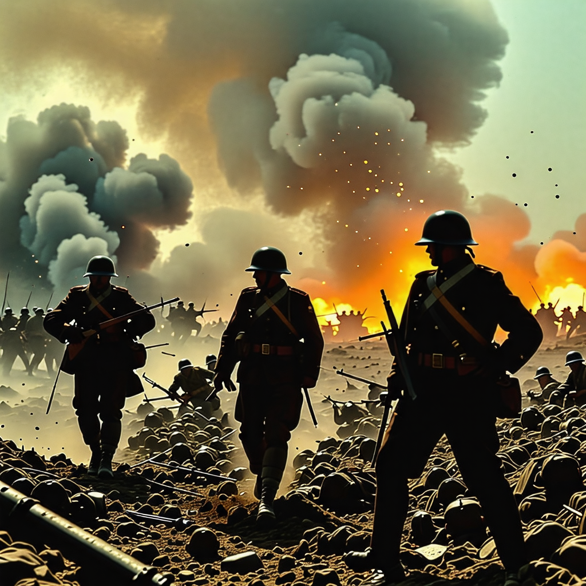
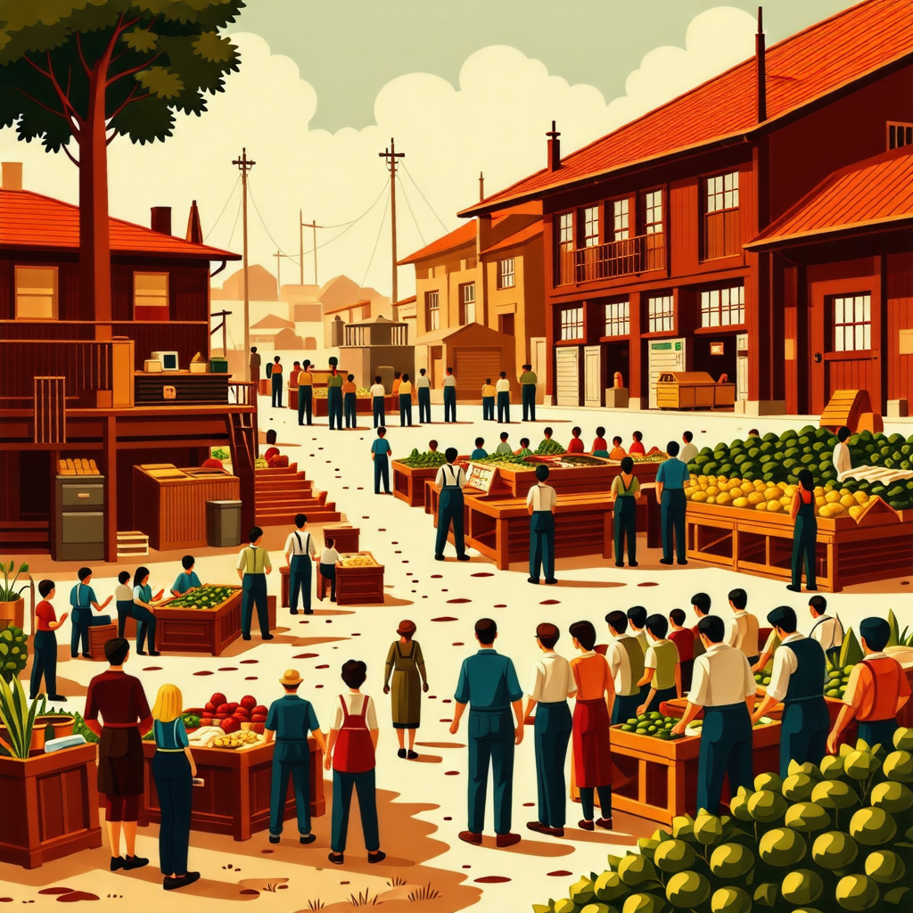
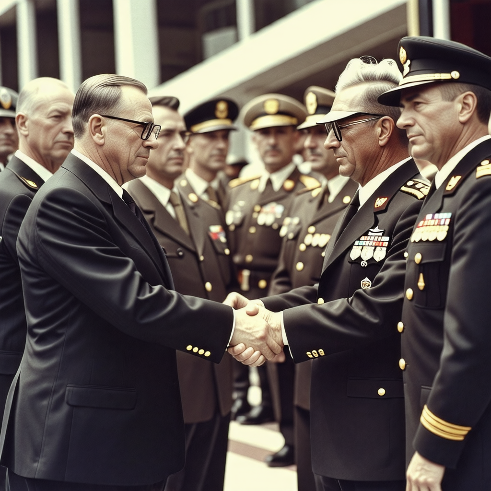
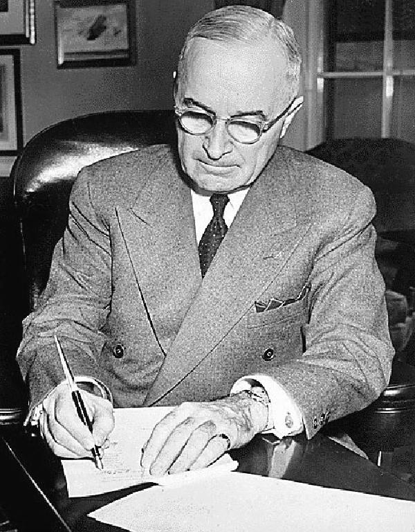
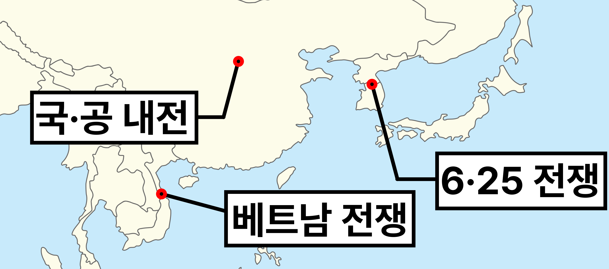
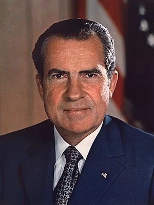

<!--footer: **냉전 - 자본주의 vs 사회주의**-->
<!--paginate: true-->

# <!--fit-->냉전 체제의 형성과 그 영향

## **:dollar: 자본주의 v.s. :hammer_and_wrench: 사회주의**

 by 10315 이도이

---

# :question: 냉전이란

-   **WW2**가 끝난 1945년부터 소련의 붕괴 직전 1991년까지 **미국**과 **소련**을 둘러싼 양측 동맹국들 사이의 긴장이 이어진 대립 시기
- 강대국간의 선전과 침투, 간접적인 경제적 군사적 압력에 의한 극심한 적대관계
-   직접적(무력) 충돌은 없지만 **군사적$\cdot$경제적$\cdot$외교적** 대립으로 긴장, 경쟁 상태가 이어지는 상태

**:large_blue_circle: 냉전(Cold War)**

**$\Updownarrow$**

**:red_circle: 열전(Hot War)**

---

<!--_paginate: hold-->

# :question: 냉전이란

PROMPT: 냉전 시대 정보 전쟁 이미지를 생성해줘

**:large_blue_circle: 냉전(Cold War)**

**$\Updownarrow$**

**:red_circle: 열전(Hot War)**

---

<!--_paginate: hold-->

# :question: 냉전이란

PROMPT: 2차 대전 열전 시대 전쟁 이미지를 생성해줘

**:large_blue_circle: 냉전(Cold War)**

**$\Updownarrow$**

**:red_circle: 열전(Hot War)**

---

# :dollar: 자본주의 & :hammer_and_wrench: 사회주의

-   **자본주의**: 1770년대 영국, 1830년대 전후
    유럽에서의 산업혁명으로 등장
     
-   **사회주의**: 마르크스의 사회주의를 기반으로 1922년 공산주의 정권 소비에트 사회주의
    공화국 연방(소련) 수립

PROMPT: 2차대전 이후 자본주의 이미지를 생성해줘

---

<!--_paginate: hold-->

# :dollar: 자본주의 & :hammer_and_wrench: 사회주의

-   **자본주의**: 1770년대 영국, 1830년대 전후
    유럽에서의 산업혁명으로 등장
     
-   **사회주의**: 마르크스의 사회주의를 기반으로 1922년 공산주의 정권 소비에트 사회주의
    공화국 연방(소련) 수립

PROMPT: 사회주의 사회 이미지를 생성해줘

---

## :exclamation: 자본주의vs사회주의 & 자유주의vs공산주의

### 경제 체제

- **자본주의**: 재화 사적 소유권을 인정, 이윤추구
- **사회주의**: 생산수단의 공유화, 계급 차별 비판

### 사회 제체

- **자유주의**: 개인의 자유, 권리 중시
- **공산주의**: 극단적 사회주의, 국가의 소멸 주장

<iframe src="https://www.desmos.com/calculator/f4qzhmxlqd?embed" width="400" height="400" style="border: 1px solid #ccc" frameborder=0></iframe>

---

<!--_transition: none-->

# :arrow_up_small: 배경

1. WW2에서 **미국**, 영국, **소련**, 중국 등 연합군이 독일, 이탈리아, 일본 등 전체주의 세력에 승리

2) 전쟁 피해 $\rightarrow$ 유럽 쇠퇴
   미국, 소련 $\rightarrow$ 강국으로 성장

 &nbsp;
 &nbsp;

제33대 미국 대통령 해리 트루먼

---

<!--_paginate: hold-->

# :arrow_up_small: 배경

1. WW2에서 **미국**, 영국, **소련**, 중국 등 연합군이 독일, 이탈리아, 일본 등 전체주의 세력에 승리

2. 전쟁 피해 $\rightarrow$ 유럽 쇠퇴
   미국, 소련 $\rightarrow$ 강국으로 성장

3. **1947년 3월 트루먼 독트린:
   공산주의 확대 저지 선언** <!--이떄를 냉전의 시작으로 본다-->

4) 미국의 **자본주의**, 소련의 **사회주의**, 두 구심점을 중심으로 동맹국이 형성

	
	제33대 미국 대통령 해리 트루먼

---

# :stop_button: 진행

1.  1949년 북대서양 조약 기구(**NATO**) & 1955년 바르샤바 조약 기구(**WTO**)를 결성하며 냉전은 절정에 달함

2)  유럽에서의 무력 충돌은 없었지만, 미국과 소련의 국방 관련 예산 증가와 더불어, 핵무기 개발까지 추진되면서, 냉전 격화

제33대 미국 대통령 해리 트루먼

---

## :stop_button: 진행 - 아시아에서의 무력 충돌

- **중국, 국.공 내전**<small>(1946~1949)</small>:
국민당, 공산당 합작 시도 무산, 내전 발생
$\rightarrow$ 마오쩌둥, 공산당 승리, 중화 인민 공화국 수립.
 타이완에서 중화민국 수립

* **베트남 전쟁**<small>(1차:1946~1954,2차:1955~1975)</small>:
호찌민 주도 공산주의 국가 베트남 민주 공화국 수립, 남북 분단, 남쪽 미국 지원 반공 정권 베트남 공화국
수립 $\rightarrow$ 베트남 전쟁 발발

* **한국, 6.25 전쟁**<small>(1950~)</small>:
38도선 경계 북쪽 소련 지원 공산;사회주의, 남쪽 미국 지원 자유;민주주의 정권 수립
$\rightarrow$ 군사 충돌, 전쟁 발발

---

# :arrow_down_small: 완화

- 데탕트: 불어로 완화라는 뜻.
냉전이 완화되어 자유주의와 공산주의 간 대립이 느슨해져 평화적 분위기, 공존을 위한 노력
- 1967년 6월 37대 미국 대통령 닉슨의
**"닉슨 독트린"** 발표, 데탕트를 위한 노력
- 1990년 동$\cdot$서 냉전의 상징 동독$\cdot$서독의 통일
- 1991년 소비에트 연방의 해체

제37대 미국 대통령 리처드 닉슨

---

<!--_paginate: hold-->

# :arrow_down_small: 완화

- 데탕트: 불어로 완화라는 뜻.
냉전이 완화되어 자유주의와 공산주의 간 대립이 느슨해져 평화적 분위기, 공존을 위한 노력
- 1967년 6월 37대 미국 대통령 닉슨의
**"닉슨 독트린"** 발표, 데탕트를 위한 노력
- 1990년 동$\cdot$서 냉전의 상징 동독$\cdot$서독의 통일
- 1991년 소비에트 연방의 해체

제37대 미국 대통령 리처드 닉슨

---
# 특징

* 경제구조에 따른 우월 경쟁 $\rightarrow$ 각자의 경제체제의 우월성을 과시
$\rightarrow$ 군비 경쟁, 기술 경쟁(우주선 경쟁 등)
* 이데올로기의 대립; 공산주의와 자유주의 사상의 차이에서 오는 우월성 경쟁

