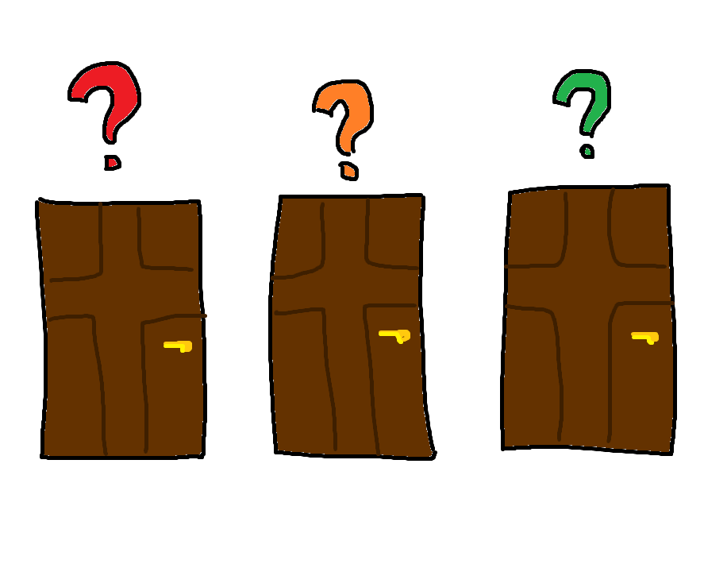
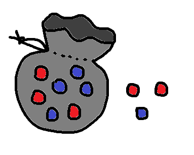
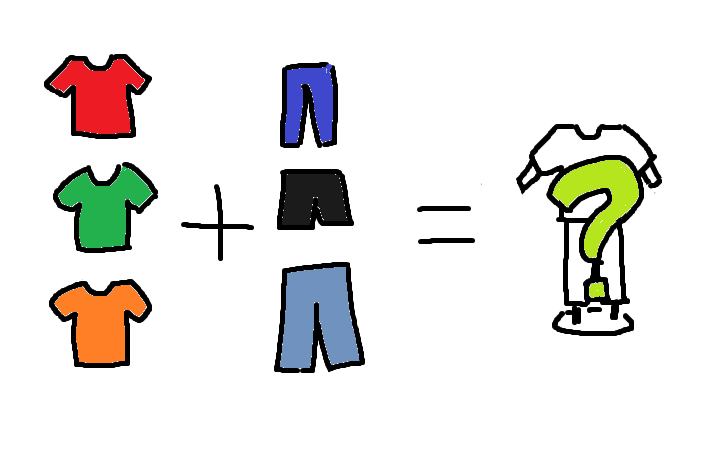

# 경우의 수

몬티 홀 문제로 알아보자

by 10315 이도이, 10303 곽대호

---

<!--footer: 경우의 수-->
<!--_class: less-right-pad-->
# 몬티 홀 문제

1) 닫혀있는 문 3개중 하나의 문 뒤에는 상품이, 나머지 문 뒤에는 꽝이있다.
2) 참가자가 문을 선택하면 진행자는 남은 문중, 꽝이 있는 문을 열어준다.
3) 진행자는 남은 두 문중, 선택지를 바꿀지, 유지할 지 고르게 된다.

---

# <!--fit-->실제로 해보자

---

<!--_class: less-right-pad-->
# 수학적으로 해결하려면?

- **사건**: 어떤 실험이나 관찰에 의하여 일어나는 결과
- **경우의 수**: 사건이 일어나는 가짓수 (단, 빠짐없이, 중복없이)

---

<!--_class: less-right-pad-->
## 합의 법칙

두 사건 $A$, $B$가 동시에 일어나지 않을 때, 사건 $A$, $B$가 일어나는 경우의 수가 각각 $m$, $n$이면 사건 $A$ 또는 사건 $B$가 일어나는 경우의 수는 $m+n$이다.

비동시 사건, 불연속 사건: '또는, 이거나, 적어도'

---

<!--_class: less-right-pad-->
## 합의 법칙

두 사건 $A$, $B$에 대하여 사건 $A$가 일어나는 경우가 $m$이고, 그 각각에 대하여 사건 $B$가 일어나는 경우의 수가 $n$일때, 두 사건 $A$, $B$가 동시에 또는 연이어 일어나는 경우의 수는 $m \times n$이다.

동시 사건, 연속 사건: '그리고, 이고, 동시에, 연이어, 모두, ...'

---

# 경우의 수 세어보기

$$
\begin{align}
\begin{cases}
1\ (\text{상품 있는 문을 고를 가짓수}) \times
\begin{cases}
2\ (\text{선택을 바꿀 가짓수}) &\rightarrow \text{변경 실패 가짓수}:  2\\
1\ (\text{선택을 바꾸지 않을 가짓수}) &\rightarrow \text{유지 성공 가짓수}: 1\\
\end{cases} \\
2\ (\text{상품 없는 문을 고를 가짓수}) \times
\begin{cases}
2\ (\text{선택을바꿀가짓수}) &\rightarrow \text{변경 성공 가짓수}: 4\\
1\ (\text{선택을 바꾸지 않을 가짓수}) &\rightarrow \text{유지 실패 가짓수}: 2\\
\end{cases} \\
\end{cases}
\end{align}
$$

 

- 선택을 변경했을때 경우의 수:
    - 성공 $4$
    - 실패 $2$
    

- 선택을 유지했을때 경우의 수:
    - 성공 $1$
    - 실패 $2$
    

---

# 감사합니다